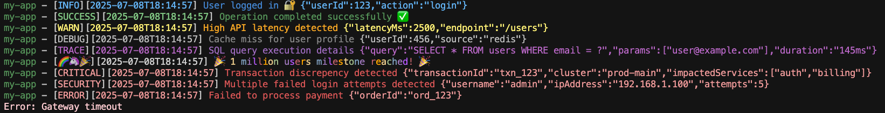

# console-flow Logging Library

A modern, flexible logging library for Node.js applications with support for structured logging, Google Cloud Platform integration, and beautiful console output.

## Features

- 🎨 **Beautiful Console Output** - Colored, formatted logs with emojis and structured data
- ☁️ **GCP Integration** - Native support for Google Cloud Logging with automatic resource detection
- 📊 **Structured Logging** - JSON and GCP LogEntry formats for production environments
- 🔧 **Flexible Configuration** - Multiple output formats and customization options
- 🚀 **Zero Dependencies** - Lightweight with minimal external dependencies
- 🧪 **TypeScript Support** - Full type safety and IntelliSense support

## Quick Start

### Basic Usage

```typescript
import {FlowLogger} from '@de44/console-flow';

// Configure console logging (recommended approach)
FlowLogger.configureConsole();

// Use native console methods with enhanced output
console.info('Hello, world!');
console.warn('This is a warning');
console.error('Something went wrong', {
  userId: 123,
  error: 'Connection failed',
});
```

### Advanced Configuration

```typescript
import {FlowLogger} from '@de44/console-flow';

// Configure with custom options
FlowLogger.configureConsole({
  format: 'cli',
  prefix: {value: 'my-app', color: 'blue_800'},
  timestamp: 'RFC3339',
  level: 'INFO',
});

// All console methods now use the enhanced logger
console.log('User logged in', {userId: 123, action: 'login'});
console.info('Database query completed', {
  query: 'SELECT * FROM users',
  duration: '45ms',
});
console.error('API request failed', new Error('Network timeout'));
```

## API Reference

### FlowLogger.configureConsole(options?)

Configures the global console object to use enhanced logging. This is the recommended approach for most applications.

**Options:**

| Option      | Type                                                                                         | Description                                        |
| ----------- | -------------------------------------------------------------------------------------------- | -------------------------------------------------- |
| `format`    | `'cli' \| 'json' \| 'prettyJson' \| 'gcp'`                                                   | Output format (default: `'cli'`)                   |
| `prefix`    | `{ value: string, color?: string }`                                                          | Application prefix for all logs                    |
| `timestamp` | `'ISO8601' \| 'RFC3339' \| 'locale' \| 'unix' \| boolean \| string`                          | Timestamp format                                   |
| `level`     | `'SECURITY' \| 'CRITICAL' \| 'ERROR' \| 'WARN' \| 'SUCCESS' \| 'INFO' \| 'DEBUG' \| 'TRACE'` | Minimum log level                                  |
| `filename`  | `string`                                                                                     | Source filename for debugging                      |
| `gcp`       | `object`                                                                                     | GCP-specific options (see GCP Integration section) |

**GCP-specific options:**

| Option                 | Type                                              | Description                                            |
| ---------------------- | ------------------------------------------------- | ------------------------------------------------------ |
| `projectId`            | `string`                                          | Optional Google Cloud project ID                       |
| `resource`             | `{ type: string, labels: Record<string,string> }` | Optional GCP monitored resource information            |
| `labels`               | `Record<string,string>`                           | Optional key-value labels to add to log entries        |
| `enableTracing`        | `boolean`                                         | Enable Cloud Trace integration (default: `false`)      |
| `enableSourceLocation` | `boolean`                                         | Include source code location in logs (default: `true`) |

### Console Methods

After calling `FlowLogger.configureConsole()`, all standard console methods are enhanced:

```typescript
// Basic logging
console.log('Info message');
console.info('Info message');
console.warn('Warning message');
console.error('Error message');

// Enhanced logging with context
console.log('User action', {userId: 123, action: 'login'});
console.error('Database error', new Error('Connection failed'), {
  retryCount: 3,
});

// Special levels (only available after configuration)
console.success('Operation completed successfully');
console.debug('Debug information');
console.trace('Detailed trace');
console.critical('Critical system failure');
console.securityAlert('Security violation detected');
console.rainbow('🌈 Special rainbow message! 🦄');
```

## Output Formats

### CLI Format (Default)

Beautiful, colored console output with structured data:



### JSON Format

Structured JSON output for log aggregation:

<!-- prettier-ignore -->
```json
{ "level": "INFO", "timestamp": "2025-07-08T15:52:08.172Z", "message": "User logged in", "metadata": { "context": {"userId": 123, "action": "login"}, "scope": {"value": "my-app"}, "filename": "auth.ts" } }
```

### Pretty JSON Format

Colored, formatted JSON for development:

```json
{
  "level": "INFO",
  "timestamp": "2025-07-08T15:52:08.172Z",
  "message": "User logged in",
  "metadata": {
    "context": {
      "userId": 123,
      "action": "login"
    }
  }
}
```

### GCP Format

Google Cloud Logging compatible format:

```json
{
  "severity": "INFO",
  "timestamp": "2025-07-08T15:52:08.172Z",
  "jsonPayload": {
    "message": "User logged in",
    "context": {"userId": 123, "action": "login"}
  },
  "resource": {
    "type": "gce_instance",
    "labels": {
      "instance_id": "123456789",
      "zone": "us-central1-a",
      "project_id": "my-project"
    }
  },
  "labels": {
    "scope": "my-app",
    "environment": "production"
  }
}
```

## GCP Integration

### Automatic Resource Detection

When running in Google Cloud Platform environments, console-flow automatically detects and includes resource information:

```typescript
// Automatically detects GCE, GKE, Cloud Run, Cloud Functions, App Engine
FlowLogger.configureConsole({
  format: 'gcp',
  gcp: {
    enableTracing: true,
    enableSourceLocation: true,
  },
});

console.info('Application started'); // Includes resource info automatically
```

### Manual Resource Configuration

```typescript
FlowLogger.configureConsole({
  format: 'gcp',
  gcp: {
    resource: {
      type: 'gce_instance',
      labels: {
        instance_id: 'my-instance-123',
        zone: 'us-central1-a',
        project_id: 'my-project',
      },
    },
    labels: {
      environment: 'production',
      service: 'auth-api',
    },
  },
});
```

### Tracing Support

```typescript
// Enable distributed tracing
FlowLogger.configureConsole({
  format: 'gcp',
  gcp: {
    enableTracing: true,
  },
});

// Trace context is automatically extracted from environment variables:
// - TRACE_ID, SPAN_ID, TRACE_SAMPLED (Cloud Trace)
// - OTEL_TRACE_ID, OTEL_SPAN_ID (OpenTelemetry)
// - TRACEPARENT (W3C Trace Context)
```

## Use Cases

### Web Application

```typescript
import {FlowLogger} from '@de44/console-flow';

// Configure once at application startup
FlowLogger.configureConsole({
  format: process.env.NODE_ENV === 'production' ? 'gcp' : 'cli',
  prefix: {value: 'web-api', color: 'blue_800'},
  level: process.env.LOG_LEVEL || 'INFO',
});

// Use throughout your application
app.get('/users/:id', (req, res) => {
  console.info('User request', {userId: req.params.id, method: 'GET'});

  try {
    const user = await getUser(req.params.id);
    console.success('User retrieved', {userId: req.params.id});
    res.json(user);
  } catch (error) {
    console.error('Failed to get user', error, {userId: req.params.id});
    res.status(500).json({error: 'Internal server error'});
  }
});
```

### Background Job

```typescript
import {FlowLogger} from '@de44/console-flow';

FlowLogger.configureConsole({
  format: 'json',
  prefix: {value: 'email-worker'},
  level: 'DEBUG',
});

async function processEmails() {
  console.info('Starting email processing', {batchSize: 100});

  for (const email of emails) {
    try {
      await sendEmail(email);
      console.success('Email sent', {emailId: email.id, recipient: email.to});
    } catch (error) {
      console.error('Failed to send email', error, {emailId: email.id});
    }
  }

  console.info('Email processing completed', {processed: emails.length});
}
```

### CLI Tool

```typescript
import {FlowLogger} from '@de44/console-flow';

FlowLogger.configureConsole({
  format: 'cli',
  prefix: {value: 'my-cli', color: 'green_600'},
  timestamp: true, // Show time only
});

async function main() {
  console.info('Starting CLI tool');

  const config = await loadConfig();
  console.debug('Configuration loaded', {configPath: config.path});

  if (!config.isValid) {
    console.error('Invalid configuration', {errors: config.errors});
    process.exit(1);
  }

  console.success('CLI tool completed successfully');
}
```

## Development

### Installation

```bash
npm install @de44/console-flow
```

### Testing

```bash
# Run all tests
npm test

# Run tests with coverage
npm run test:coverage

# Run tests in watch mode
npm run test:watch
```

### Building

```bash
npm run build
```

### Publishing

```bash
npm publish --access public
```

## Roadmap

- [x] Add plugin support
- [x] Add cloud formats
- [x] Support [Structured Logging](https://cloud.google.com/logging/docs/reference/v2/rest/v2/LogEntry) format
- [x] Add `instanceId` when format=`json` or `cloud`
- [x] Set default options based on format
- [ ] Create MCD plugin
- [ ] Support custom CLI formats
- [ ] Allow icons only for levels

## License

MIT License - see LICENSE file for details.
